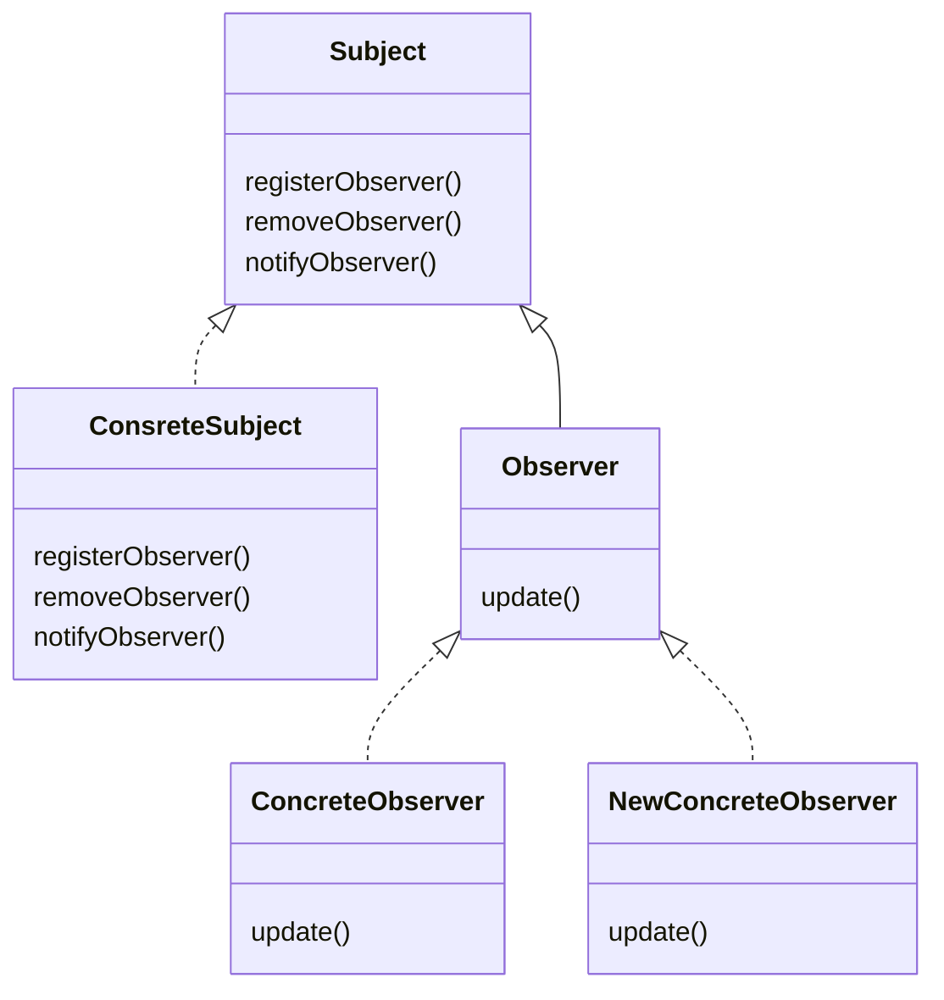
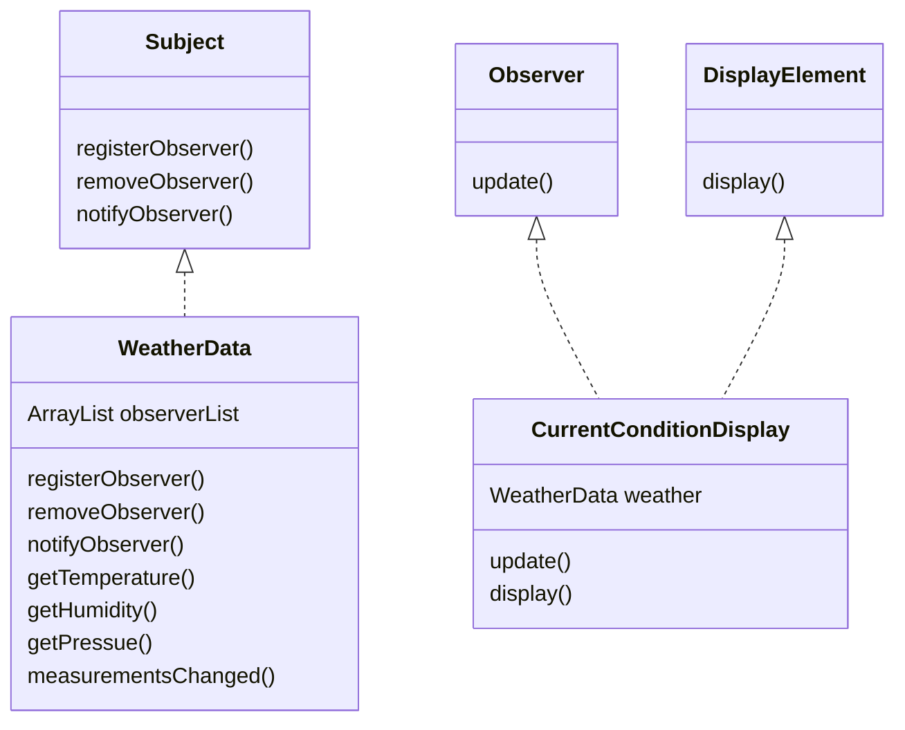

>  你嘴凑上来，我对你嘴说，这话就一直钻到你的心里，省得走远路，拐了弯从耳朵里进去。  
>
>  -- -- 钱钟书《围城》  

### 天气监测应用简单设计和实现

#### 1. 要求

建立一个应用，利用WeatherData对象获取数据，并更新公告板。

```java
public class WeatherData{
    getTemperature()//获取温度
    getHumidity()//获取湿度
    getPressue()//获取起亚
    measurementsChanged()//气象数据更新，此方法被调用
    //其他方法
}
```

#### 2. 分析

需求：WeatherData对象有三个值得getter方法，当气象数据更新时，meansurementsChanged()方法会被调用，我们需要实现把三个气象数据展示到公告板。同时这个系统必须有扩展性。

#### 3.定义观察者模式

**观察者模式定义了对象之间的一对多依赖，这样一来，当一个对象改变状态时，他的所有依赖者都会收到通知并且自动更新**。我们说这个“**对象**”是主题(subject)，而“**多个依赖**”是观察者(Observer)。观察者模式定义了一对多关系，观察者依赖于主题，只要主题一有变化，观察者就会被通知。

#### 4.观察者类图

主题由多个观察者订阅，观察者关注了主题



#### 5. 气象站类图设计



#### 6.实现气象站

##### 6.1定义接口

```java
//主题接口
public interface Subject {
    void registerObserver(Observer observer);//注册观察者
    void removeObserver(Observer observer);//移除观察者
    void notifyObservers();//通知观察者
}
//观察者接口
public interface Observer {
    void update(float temperature,float humidity,float pressure);//观察者具体的动作实现
}
//公告接口
public interface DisplayElement {
    void display();//用于公告展示
}
```

##### 6.2定义实现类

```java
//天气数据作为主题
public class WeatherData implements Subject {
    private float temperature;
    private float humidity;
    private float pressure;
    private ArrayList<Observer> observers;

    public WeatherData() {
        this.observers = new ArrayList<>();
    }

    @Override
    public void registerObserver(Observer observer) {
        observers.add(observer);
    }

    @Override
    public void removeObserver(Observer observer) {
        int i = observers.indexOf(observer);
        if (i > 0) {
            observers.remove(observer);
        }
    }
    @Override
    public void notifyObservers() {
        observers.forEach(observer -> {
            observer.update(temperature, humidity, pressure);
        });
    }
    //气象数据变化被调用
    public void measurementsChanged() {
        notifyObservers();
    }
    //模拟气象数据变化
    public void setMeasurements(float temperature, float humidity, float pressure) {
        this.temperature = temperature;
        this.humidity = humidity;
        this.pressure = pressure;
        measurementsChanged();
    }
}

//当前天气公告作为一个观察者
public class CurrentConditionDisplay implements Observer, DisplayElement {
    private float temperature;
    private float humidity;
    private float pressure;
    private final Subject weatherData;//持有一个主题的引用，可以方便取消观察等操作

    public CurrentConditionDisplay(Subject Subject) {
        this.weatherData = Subject;
        this.weatherData.registerObserver(this);//注册成为观察者
    }
    public void cancelObserve() {
        this.weatherData.removeObserver(this);//取消观察
    }
    @Override
    public void display() {
        System.out.println("当前天气情况：" + "温度是" +
                temperature + "摄氏度, 湿度是" + humidity + "%, 气压是" + pressure);
    }
    @Override
    public void update(float temperature, float humidity, float pressure) {
        this.temperature = temperature;
        this.humidity = humidity;
        this.pressure = pressure;
        display();
    }
}
```

##### 6.3 气象站就可以实现了

```java
public class WeatherStation {
    public static void main(String[] args) {
        WeatherData weatherData = new WeatherData();//创建主题
        CurrentConditionDisplay conditionDisplay = new CurrentConditionDisplay(weatherData);//创建一个观察者

        System.out.println("气象数据改变");
        weatherData.setMeasurements(28,65,30.4f);//模拟气象改变
        System.out.println("气象数据改变");
        weatherData.setMeasurements(29,62,29.4f);//模拟气象改变
        System.out.println("气象数据改变");
        weatherData.setMeasurements(26,75,28.4f);//模拟气象改变
    }
}
```

##### 6.4 运行结果

```shell
气象数据改变
当前天气情况：温度是28.0摄氏度, 湿度是65.0%, 气压是30.4
气象数据改变
当前天气情况：温度是29.0摄氏度, 湿度是62.0%, 气压是29.4
气象数据改变
当前天气情况：温度是26.0摄氏度, 湿度是75.0%, 气压是28.4
```

##### 6.5 易于扩展

此时如果需要新增一个公告栏，我们仅需新增一个Observer和DisplayElement接口的实现类，实现对应的方法即可。

##### 7 小扩展

事实上，对于主题状态的变化，主题可以主动把状态变化**推**给观察者；同样的道理，观察者意识到主题状态变化时也可以去主题那边**拉**取主题的状态变化

### 使用Java内置的观察者模式

##### 1.被观察者

```java
public class WeatherData extends Observable {
    private float temperature;
    private float humidity;
    private float pressure;

    //气象数据变化被调用
    public void measurementsChanged() {
        setChanged();//父类的状态变化标识
        notifyObservers();
    }
    //模拟气象数据变化
    public void setMeasurements(float temperature, float humidity, float pressure) {
        this.temperature = temperature;
        this.humidity = humidity;
        this.pressure = pressure;
        measurementsChanged();
    }
    public float getTemperature() {
        return temperature;
    }
    public float getHumidity() {
        return humidity;
    }
    public float getPressure() {
        return pressure;
    }
}
```

##### 2.观察者

```java
public class CurrentConditionDisplay implements Observer, DisplayElement {
    private float temperature;
    private float humidity;
    private float pressure;

    public CurrentConditionDisplay(Observable observable) {
        observable.addObserver(this);
    }
    @Override
    public void display() {
        System.out.println("当前天气情况：" + "温度是" +
                temperature + "摄氏度, 湿度是" + humidity + "%, 气压是" + pressure);
    }
    @Override
    public void update(Observable o, Object arg) {
        if (o instanceof WeatherData) {
            WeatherData weatherData = (WeatherData) o;
            humidity = weatherData.getHumidity();
            temperature = weatherData.getTemperature();
            pressure = weatherData.getPressure();
            display();
        }
    }
}
```

此处采用的拉取模式，由观察者自行获取被观察者的状态数据

### Java内置的观察者模式分析

1. ##### Push和Pull模式

   1. notifyObservers(Object arg)：带参数的notifyObservers(Object arg):这个参数Object arg 其实就是 Observer接口中的update(Observable o, Object arg)方法中的第二个参数 。就是通知观察者所改变的数据对象。简单理解就是由主题主动的push需要改变的数据对象给观察者。
   2. notifyObservers()：不带参数的方法，传递一个null数据对象给观察者，需要观察者主动到主题pull数据。

2. ##### 分析下notifyObservers(Object arg)方法

   ```java
   public void notifyObservers(Object arg) {
       Object[] arrLocal;//对所有的观察者进行了一个本地缓存
       synchronized (this) {
           if (!changed)return;//只有changed为true才会通知
           arrLocal = obs.toArray();//转为对象数组
           clearChanged();//清除状态变化
       }
       for (int i = arrLocal.length-1; i>=0; i--)
           ((Observer)arrLocal[i]).update(this, arg);//发起通知
   }
   ```

   这里采用了内部声明的对象数组的方法，在调用update方法的时候并没有上锁，不会存在线程安全隐患吗？

   1. arrLocal是方法内部变量，内部变量存放在栈中，是线程私有的，不会被共享。
   2. 在进行集合转数组时是同步加锁的。其他线程不会访问到synchronized里的变量。
   3. arrLocal相当于对所有的观察者进行了一个缓存，可以有效防止一个线程删除一个线程添加时导致的ConcurrenModifyException和NullPointerException。
   4. 利用集合转换数组的方法可以把观察者保存起来，进行独立的操作，这部分数据的更新是完全不依赖于外部变化的。所以也就不存在线程安全问题。
   5. 同时也导致了源码注视中的两个问题：
      1. 新添加的观察者可能会错过一次通知。
      2. 新删除的观察者可能会多接收一次通知。
   6. 这个notifyObservers(Object arg)方法没有在方法级别加锁，主要是为了避免观察者数量比较多的时候，没有获取到锁的线程都将被阻塞，性能低下。

### 总结

设计原则：

1. 封装变化

   找出程序中可能变化的部分，把他们抽取并且封装起来，使其不影响不变的部分

2. 针对接口编程，而不是针对实现编程

   变量的声明应该是超类型(supertype)，通常是一个抽象类或者接口，如此，只要是具体实现次此超类型的类锁产生的对象都可以指定给这个变量，这也意味着，声明类时不用理会以后执行时的真正对象类型

3. 多使用组合，少使用继承

4. 为了交互对象之间的松耦合和设计而努力

   对象之间的互相依赖降低到最低可以让我们建立有弹性的系统，能够应付变化。改变主题或者观察者，并不会影响到另一方，只要他们之间的接口关系仍然被遵守，我们就可以轻易的扩展。

